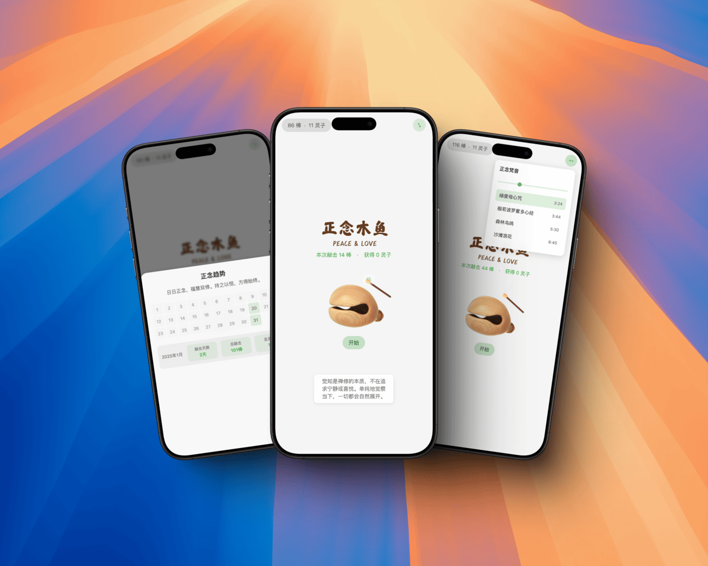

# 正念木鱼

一个优雅简约的正念木鱼渐进式网页应用（PWA），通过传统木鱼的数字化演绎，结合自动敲击和正念梵音，帮助用户在繁忙的数字世界中获得内心的宁静与平和。

## 特色功能

- 精美的木鱼敲击动画效果
- 真实的木鱼音效，带来沉浸式体验
- 自动敲击功能，让您专注于冥想
- 正念梵音播放，营造宁静氛围
- 灵子获取系统，记录修行进程
- 优雅的气泡动画效果
- 修行统计和历史记录
- 完整的PWA支持，可安装到桌面使用
- 响应式设计，完美适配各种设备
- 离线使用功能

## 宁静之旅

正念木鱼不仅仅是一个简单的敲击工具，更是您通向内心平静的桥梁：

1. **自动敲击模式**
   - 选择适合的节奏速度
   - 让木鱼自动敲击，您可以专注于呼吸和冥想
   - 沉浸在规律的节奏中，放空思绪

2. **正念梵音**
   - 优美的颂钵音效
   - 传统佛教音乐
   - 创造专属的冥想空间

3. **灵子系统**
   - 每次敲击都是一次修行
   - 获得的灵子象征着您的修行进程
   - 通过持续练习积累更多灵子

## 技术栈

- HTML5 + CSS3 + JavaScript
- PWA (Progressive Web App)
- LocalStorage 用于数据持久化
- Service Worker 实现离线功能
- Web Audio API 处理音频
- CSS3 动画效果

## 安装说明

### 方式一：直接使用

1. 访问在线地址：[https://maikami.com/woodenfish/](https://maikami.com/woodenfish/)
2. 在支持PWA的浏览器中，可以点击地址栏的"安装"按钮将应用添加到桌面

### 方式二：本地部署

1. 克隆项目到本地
2. 确保所有资源文件齐全：
   - `woodfish.png` - 木鱼主图
   - `stick.png` - 木鱼棒图片
   - `woodfish-sound.mp3` - 基础音效
   - `woodfish-sound1.mp3` - 随机音效1
   - `woodfish-sound2.mp3` - 随机音效2
   - `颂钵.mp3` - 特殊音效
   - 其他图标文件在 `icons` 目录下
3. 使用本地服务器（如 Live Server）运行项目

## 使用指南

1. **基本操作**
   - 点击木鱼发出敲击音效
   - 长按木鱼可以触发连续敲击
   - 每次敲击都有机会获得灵子
   - 开启自动敲击，让您更专注于冥想

2. **灵子系统**
   - 灵子会以气泡动画形式显示
   - 累计灵子数会保存在本地
   - 可以查看历史修行记录

3. **离线使用**
   - 首次访问后，应用可离线使用
   - 所有音效和图片资源都会被缓存

4. **设备支持**
   - 支持电脑和移动设备
   - 支持触屏和鼠标操作
   - 支持键盘空格键操作

## 贡献指南

欢迎提交 Issue 和 Pull Request 来完善这个项目。在提交代码前，请确保：

1. 代码风格保持一致
2. 新功能有充分的注释说明
3. 所有资源文件都已正确引用

## 开源协议

本项目采用 MIT 协议开源，详见 LICENSE 文件。

## 致谢

感谢所有为这个项目提供反馈和建议的用户。
