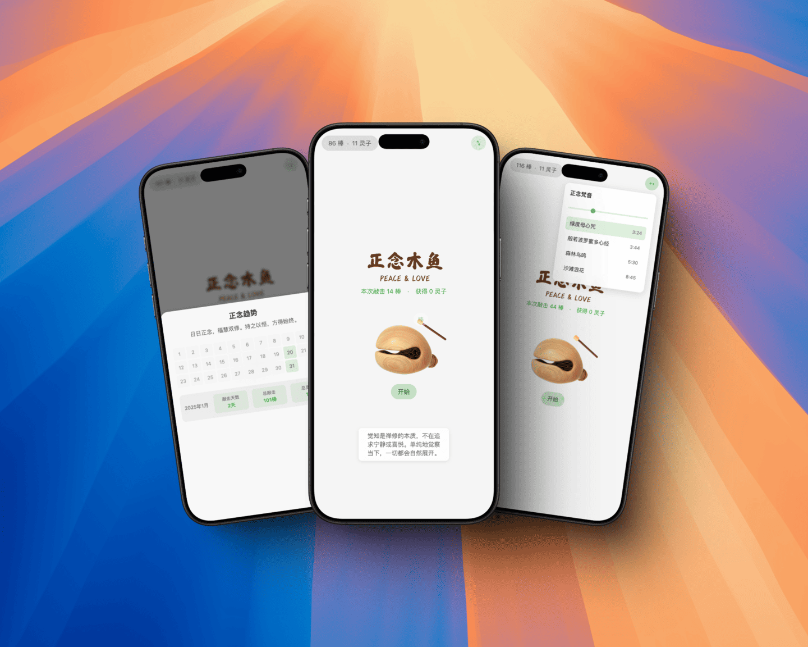

# 正念木鱼

一个优雅简约的正念木鱼渐进式网页应用（PWA），通过传统木鱼的数字化演绎，结合自动敲击木鱼和正念梵音，帮助用户在繁忙的数字世界中获得内心的宁静与平和。

## 特色功能

- 精美的木鱼敲击动画效果
- 真实的木鱼音效，带来沉浸式体验
- 自动敲击功能，让您专注于冥想
- 正念梵音播放，营造宁静氛围
- 灵子获取系统，记录修行进程
- 优雅的气泡动画效果
- 修行统计和历史记录
- 修行码云同步，支持多设备恢复和延续修行数据
- 完整的PWA支持，可安装到桌面使用
- 响应式设计，完美适配各种设备
- 离线使用功能

## 宁静之旅

正念木鱼不仅仅是一个简单的敲击工具，更是您通向内心平静的桥梁：

1. **自动敲击模式**
   - 选择适合的节奏速度
   - 让木鱼自动敲击，您可以专注于呼吸和冥想
   - 沉浸在规律的节奏中，放空思绪

2. **正念梵音**
   - 般若波罗蜜多心经
   - 绿度母心咒
   - 森林鸟鸣
   - 沙滩浪花

3. **灵子系统**
   - 每次敲击都是一次修行
   - 获得的灵子象征着您的修行进程
   - 通过持续练习积累更多灵子

## 技术栈

- HTML5 + CSS3 + JavaScript
- PWA (Progressive Web App)
- LocalStorage 本地优先持久化
- Service Worker 实现离线功能
- Web Audio API 处理音频
- CSS3 动画效果
- Cloudflare Workers + D1 + KV 实现云同步

## 数据同步架构

正念木鱼的数据同步经历了三段演进：

1. **单机本地优先**
   - 敲击、灵子、每日趋势全部先写入 LocalStorage。
   - 页面响应不依赖网络，离线也能继续修行。
   - 这是当前架构仍然保留的基础：本地永远是第一写入点。

2. **KV 多端同步**
   - 引入 6 位修行码，用户无需注册即可在多设备之间恢复数据。
   - Cloudflare Workers + KV 保存 `{totalHits,totalScore,dailyData}`。
   - 服务端使用 max 合并策略，保证多端同步时敲击只增不减。
   - 这个阶段解决了“换设备数据还在”的问题，但 KV 更适合低频状态保存，不适合大量用户长时间高频累计。

3. **D1 增量同步**
   - 客户端改为累计 pending delta，持续敲击时低频批量上报。
   - 每次同步带 `sessionId` 和 `eventId`，Worker 用 D1 去重并按天累加。
   - D1 保存结构化表：修行码总计、每日统计、同步事件。
   - Worker 仍兼容旧版 KV 数据和旧客户端整份 payload，已有用户可以平滑迁移。

当前同步策略是：本地实时更新，云端按增量最终同步；结束修行、关闭自动敲击、页面隐藏或关闭时会立即补推未同步数据。这让免费层也能支撑更多长时间自动敲击用户，同时保留多设备恢复能力。

## 安装说明

### 方式一：直接使用

1. 访问在线地址：[https://woodenfish.bibidu.com/](https://woodenfish.bibidu.com/)
2. 在支持PWA的浏览器中，可以点击地址栏的"安装"按钮将应用添加到桌面

### 方式二：本地部署

1. 克隆项目到本地
2. 确保所有资源文件齐全
3. 使用本地服务器（如 Live Server）运行项目

## 使用指南

1. **基本操作**
   - 点击木鱼发出敲击音效
   - 长按木鱼可以触发连续敲击
   - 每次敲击都有机会获得灵子
   - 开启自动敲击，让您更专注于冥想

2. **灵子系统**
   - 灵子会以气泡动画形式显示
   - 累计灵子数会保存在本地
   - 可以查看历史修行记录

3. **离线使用**
   - 首次访问后，应用可离线使用
   - 所有音效和图片资源都会被缓存

4. **设备支持**
   - 支持电脑和移动设备
   - 支持触屏和鼠标操作
   - 支持键盘空格键操作

## 贡献指南

欢迎提交 Issue 和 Pull Request 来完善这个项目。在提交代码前，请确保：

1. 代码风格保持一致
2. 新功能有充分的注释说明
3. 所有资源文件都已正确引用

## 开源协议

本项目采用 MIT 协议开源，详见 LICENSE 文件。

## 致谢

感谢所有为这个项目提供反馈和建议的用户。
